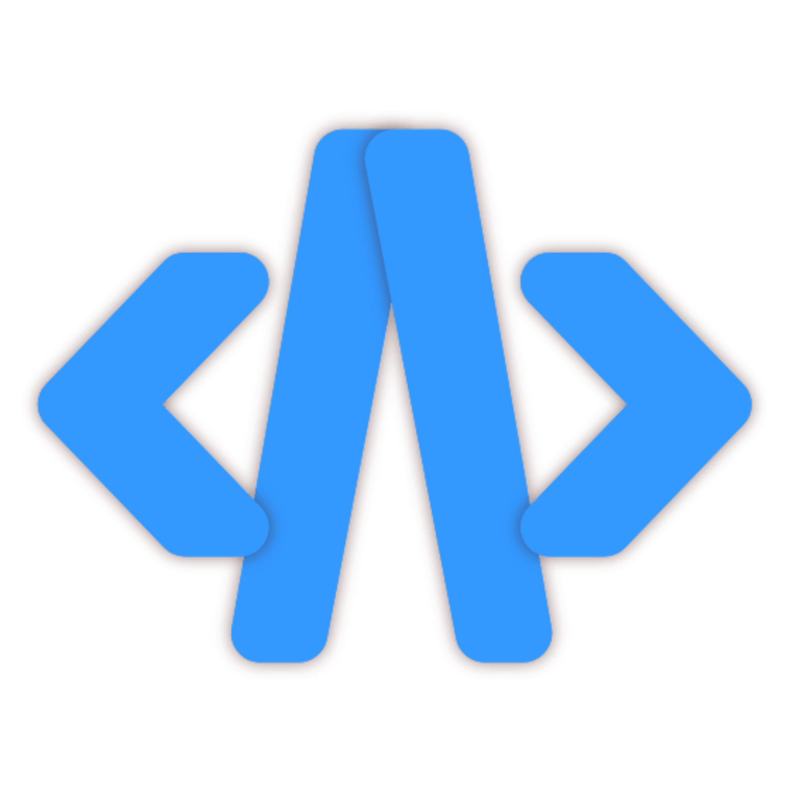

# Acode Rocdex — Code Editor for Android with Codex CLI Integration

<p align="center">
  
</p>

<p align="center">
  <strong>Rocdex</strong> — A fork of Acode with Codex CLI (codexapp) integration.
</p>

## • Overview

Acode Rocdex is a powerful, lightweight code editor and web IDE for Android, forked from [Acode](https://github.com/Acode-Foundation/Acode) with integrated [Codex CLI](https://github.com/openai/codex) web UI support via the Rocdex plugin.

## • Features

- All original Acode features (edit, preview, FTP/SFTP, GitHub, 100+ languages)
- **Rocdex Plugin** — Start/stop the Codex CLI web UI directly from the editor
- In-app Codex interface (iframe)
- License-based activation system
- Optimized for paid distribution

## • Installation

Build the APK using GitHub Actions:

1. Push to the `main` branch
2. Go to **Actions** → **Build APK (Rocdex)** → **Run workflow**
3. Select `paid` as the app type
4. Download the APK from the build artifacts

## • Package Info

- **Paid version:** `com.rocdebug.acode`
- **Free version:** `com.rocdebug.acodefree`
- **Version:** 1.12.6

## • Building Locally

```bash
npm install
cordova platform add android
node utils/setup.js
sh utils/scripts/build.sh paid prod
```

## • License Activation

Generate license keys for users:

```bash
node utils/gen-license.js user@example.com
```

## • Project Structure

<pre>
Acode Rocdex/
|
|- src/           - Core code and language files
|- www/           - Public documents, compiled files
|- utils/         - CLI tools for building and license generation
|- src/plugins/rocdex/ - Codex CLI integration plugin
</pre>

## • Upstream

This project is based on [Acode](https://github.com/Acode-Foundation/Acode) by Foxdebug.
